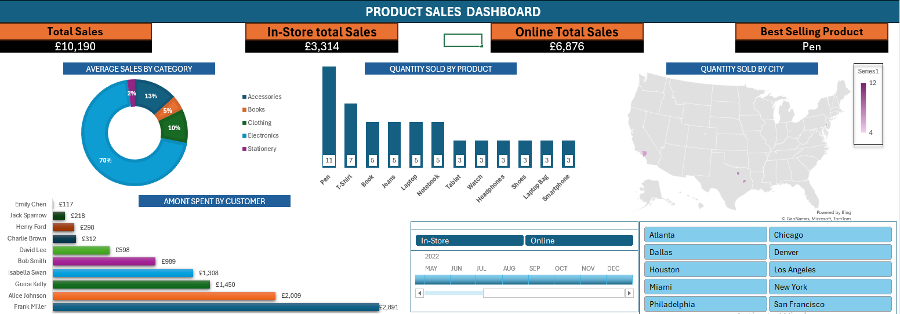

# PROJECT 1

**TITLE:** [Sales Interactive Dashboard](https://github.com/officialillumine1/officialillumine1.github.io/blob/main/Sales%20Accts%20Real.xlsx)

**TOOLS USED:** Microsoft Excel (Pivot Chart, Pivot tables, Conditional formating, filters, slicers, timelines)

**PROJECT DESCRIPTION:** Executive Sales Overview Dashboard: This dashboard delivers key sales insights in a concise and visually engaging format. It highlights total sales, split into in-store and online performance, with figures for the best-selling product and average sales by category. Detailed analytics include quantity sold by product, city-wise sales distribution, and customer spending trends. A slicer allows stakeholders to filter data by city, and a timeline provides an overview of sales trends over time. Designed for strategic decision-making, this dashboard offers a clear and actionable view of business performance to drive informed discussions and planning.

**KEY FINDINGS:** 
1. **Total Sales Performance**: A clear view of overall sales trends, revealing whether sales targets are being met across in-store and online channels.

2. **Best-Selling Product**: Identification of the top-performing product, which could guide inventory planning and marketing strategies.

3. **Category Analysis**: Average sales by category highlight which product categories are driving the most revenue, helping prioritize resource allocation.

4. **Regional Trends**: Quantity sold by city reveals top-performing and underperforming locations, offering insights for regional marketing efforts or store expansions.

5. **Customer Spending**: Analysis of customer spending patterns helps understand customer behavior, enabling more tailored sales or loyalty programs.

6. **Product-Level Insights**: Quantity sold by product uncovers high-demand products, which can inform stock management and pricing strategies.

7. **Time-Based Trends**: The timeline provides visibility into seasonal or temporal sales trends, aiding in demand forecasting and promotional planning.

**DASHBORD OVERVIEW:**

